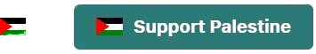

# Add a Palestine Flag Button to Your Website
Easily add a Palestine Flag Button to your website to show support and raise awareness. This repository provides a self-contained snippet for plain HTML use and instructions for integrating it into WordPress and other website builders.

## Example
[](https://www.unrwa.org)

## Features  
- **Two Display Options**:  
  - A **flag button** that links to a charity or another resource.  
  - A **standalone flag with a tooltip** (no button).  
- **Customizable**: Modify background colors, hover effects, or tooltip text.  
- **Raise Money for Trusted Humanitarian Relief Organisations**:  
  - [UNRWA](https://www.unrwa.org/) – United Nations Relief and Works Agency for Palestine Refugees.  
  - [Islamic Relief](https://www.islamic-relief.org/) – Provides emergency aid and development projects.  
  - [Medical Aid for Palestinians (MAP)](https://www.map.org.uk/) – Focused on healthcare in Palestine.  

## Code
### **Option 1: Flag Button with Link**  
Copy the Code:
Use this snippet to display a button with a flag.
```
<a 
    href="https://www.unrwa.org/" 
    target="_blank" 
    style="background-color: #2b7a78; display: inline-flex; align-items: center; gap: 10px; padding: 10px 20px; font-size: 16px; font-weight: bold; color: white; border: none; border-radius: 5px; text-decoration: none; cursor: pointer; transition: background-color 0.3s ease;"
    onmouseover="this.style.backgroundColor='#17252a'" 
    onmouseout="this.style.backgroundColor='#2b7a78'">
    <span 
      style="width: 24px; height: 16px; display: inline-block; position: relative;">
      <span 
        style="width: 100%; height: 33.33%; background-color: #000000; display: block;"></span>
      <span 
        style="width: 100%; height: 33.33%; background-color: #ffffff; display: block;"></span>
      <span 
        style="width: 100%; height: 33.33%; background-color: #008000; display: block;"></span>
      <span 
        style="content: ''; position: absolute; top: 0; left: 0; width: 0; height: 0; border-top: 8px solid transparent; border-bottom: 8px solid transparent; border-left: 12px solid #ff0000;">
      </span>
    </span>
    Support Palestine
  </a>
```
### **Option 2: Standalone Flag with Tooltip**
Copy the Code:
Use this snippet to display only the flag with a tooltip.

```
<a 
  href="https://www.unrwa.org/" 
  target="_blank" 
  style="position: relative; display: inline-block; width: 24px; height: 16px; text-decoration: none; cursor: pointer;" 
  title="Support Palestine">
  <div 
    style="width: 100%; height: 33.33%; background-color: #000000;"></div>
  <div 
    style="width: 100%; height: 33.33%; background-color: #ffffff;"></div>
  <div 
    style="width: 100%; height: 33.33%; background-color: #008000;"></div>
  <div 
    style="content: ''; position: absolute; top: 0; left: 0; width: 0; height: 0; border-top: 8px solid transparent; border-bottom: 8px solid transparent; border-left: 12px solid #ff0000;">
  </div>
</a>
```

## How to Install  

1. **Copy the Code**:  
   Copy the provided HTML snippet for the Palestine Flag with or without Button.  

2. **Paste the Code Anywhere**:  
   - Locate the **Custom HTML option** in your website builder. This is available in most popular platforms:  
     - **WordPress**: Use a **Custom HTML block**  
     - **Wix**: Add an **Embed HTML** section.  
     - **Squarespace**: Use the **Code block** feature.  
   - Paste the copied code into the editor.  

3. **Optionally Edit Colors**:  
   You can adjust the button's appearance by editing these inline styles directly within the code:  
   - **`background-color`**: Changes the button's main background color.  
   - **Mouseover Color**: Look for `onmouseover` and `onmouseout` styles to modify how the button reacts when hovered over:  
     - `onmouseover="this.style.backgroundColor='#17252a'"`  
     - `onmouseout="this.style.backgroundColor='#2b7a78'"`  
   - Example changes:  
     ```html
     onmouseover="this.style.backgroundColor='#ff6347'" 
     onmouseout="this.style.backgroundColor='#4682b4'"
     ```

 4. **Customize the Link** 

Update the `href` attribute in the HTML snippet to link to a trusted charity or another relevant resource.
Examples:
- **[UNRWA](https://www.unrwa.org/)** – United Nations Relief and Works Agency for Palestine Refugees.  
- **[Islamic Relief](https://www.islamic-relief.org/)** – Provides emergency aid and development projects.  
- **[Medical Aid for Palestinians (MAP)](https://www.map.org.uk/)** – Focused on healthcare in Palestine.  

5. **Save Your Changes**:  
   - Save and publish your website updates to display the button.
  
## Need Help with Installation?  

If you need assistance installing the flag on your website or customizing it for your platform, feel free to reach out!  
**Email**: [egg-droid@protonmail.com](mailto:egg-droid@protonmail.com)  

We'll be happy to help you showcase your support for Palestine on your website.  


## Donate to Keep Similar Projects Going  

If you find this project helpful and would like to support similar initiatives, consider donating to us. Your contribution will help fund future projects and enhancements.  
**Donate via Bitcoin**: [12YnCS3hhCJCyfAWx23xh22JPGjojpnDUz](bitcoin:12YnCS3hhCJCyfAWx23xh22JPGjojpnDUz)

  
## Donate to Trusted Charities  

If you'd like to contribute directly to supporting Palestine, consider donating to one of these trusted organizations:  
- **[UNRWA](https://www.unrwa.org/)** – United Nations Relief and Works Agency for Palestine Refugees.  
- **[Islamic Relief](https://www.islamic-relief.org/)** – Provides emergency aid and development projects.  
- **[Medical Aid for Palestinians (MAP)](https://www.map.org.uk/)** – Focused on healthcare in Palestine.  
